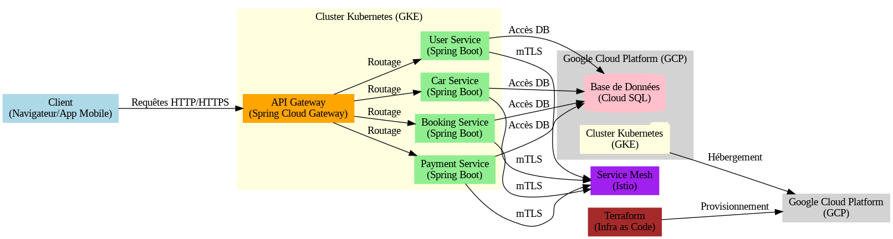

# Projet Car-Rental

## Description du Projet
Le projet **Car-Rental** est une application de location de voitures en ligne qui permet aux utilisateurs de rechercher, réserver et payer des voitures de manière simple et sécurisée. L'application est divisée en deux parties principales :
- **Backend** : Développé avec Java Spring Boot, il expose des API REST pour gérer les utilisateurs, les voitures, les réservations et les paiements.
- **Frontend** : Développé avec Angular, il fournit une interface utilisateur intuitive pour interagir avec les fonctionnalités du backend.

L'application est basée sur une architecture microservices, déployée dans un environnement cloud, et utilise des technologies modernes pour assurer scalabilité, performance et sécurité.

---

## Architecture du Projet

### Diagramme d'Architecture


### Schema d'architecture pour exposer  les services 

                             [ Clients externes ]
                                    │
                                    ▼
      ┌─────────────────────────────────────────────┐
      │          LoadBalancer Service (Cloud)       │
      │  (Exposé via un Load Balancer externe)      │
      └─────────────────────────────────────────────┘
                                    │
                                    ▼
                        ┌───────────────────┐
                        │   NodePort Service │  (Exposé sur chaque nœud à un port spécifique)
                        └───────────────────┘
                                    │
          ┌───────────────────────────────────────────┐
          │    Accès possible depuis l'extérieur      │
          │       via NodeIP:NodePort                 │
          └───────────────────────────────────────────┘
                                    │
                                    ▼
                     ┌─────────────────────────┐
                     │     ClusterIP Service   │  (Par défaut, accessible uniquement dans le cluster)
                     └─────────────────────────┘
                                    │
                                    ▼
           ┌───────────────────────────────────────┐
           │           Kubernetes Cluster          │
           │ ┌─────────────────────────────────┐  │
           │ │         Application Pods        │  │
           │ │   (Exécutant l’application)     │  │
           │ └─────────────────────────────────┘  │
           └───────────────────────────────────────┘

               ExternalName Service
   (Crée un alias DNS pour un service externe,
    ex: foo.bar.example.com)


### Composants Principaux
#### Backend
1. **API Gateway** : Un point d'entrée unique pour toutes les requêtes, qui les route vers les microservices appropriés.
2. **Microservices** :
   - **User Service** : Gère l'authentification et les informations des utilisateurs.
   - **Car Service** : Gère le catalogue des voitures disponibles.
   - **Booking Service** : Gère les réservations de voitures.
   - **Payment Service** : Gère les transactions de paiement.
3. **Base de Données** : Une base de données relationnelle (MySQL ou PostgreSQL) stocke les données des utilisateurs, des voitures et des réservations.
4. **Cluster Kubernetes** : Les microservices sont déployés dans un cluster Kubernetes hébergé sur Google Kubernetes Engine (GKE).
5. **Service Mesh (Istio)** : Facultatif, pour la gestion de la communication sécurisée entre les services.
6. **Terraform** : Automatise le déploiement de l'infrastructure sur GCP.

#### Frontend
1. **Angular Application** : Une application web moderne qui interagit avec le backend via des API REST.
   - **Pages Principales** :
     - Page d'accueil : Affichage des voitures disponibles.
     - Page de connexion/inscription : Gestion de l'authentification.
     - Page de réservation : Réservation d'une voiture.
     - Page de paiement : Gestion des transactions.
   - **Services Angular** : Des services Angular sont utilisés pour communiquer avec le backend (par exemple, `UserService`, `CarService`, `BookingService`).

---

## Technologies Utilisées

### Backend
- **Java Spring Boot** : Framework pour développer les microservices REST.
- **Spring Cloud Gateway** : Pour implémenter l'API Gateway.
- **Docker** : Pour conteneuriser les microservices.
- **Kubernetes** : Pour orchestrer les conteneurs et gérer le cluster.
- **Terraform** : Pour l'automatisation de l'infrastructure.
- **Google Cloud Platform (GCP)** :
  - **Google Kubernetes Engine (GKE)** : Pour héberger le cluster Kubernetes.
  - **Cloud SQL** : Pour la base de données MySQL/PostgreSQL.
  - **Cloud Storage** : Optionnel, pour stocker des fichiers (par exemple, des images de voitures).
- **Service Mesh (Istio)** : Pour la communication sécurisée entre les services.

### Frontend
- **Angular** : Framework pour développer l'interface utilisateur.
- **Angular Material** : Pour des composants UI modernes et réactifs.
- **RxJS** : Pour la gestion des flux de données asynchrones.
- **HTTPClient** : Pour communiquer avec les API du backend.

---

## Interaction entre Backend et Frontend
Le frontend (Angular) interagit avec le backend (Spring Boot) via des API REST exposées par l'API Gateway. Voici un exemple de flux typique :
1. **Recherche de Voitures** :
   - Le frontend envoie une requête GET à l'API Gateway (`/api/cars`).
   - L'API Gateway route la requête vers le **Car Service**.
   - Le **Car Service** renvoie la liste des voitures disponibles.
2. **Réservation d'une Voiture** :
   - Le frontend envoie une requête POST à l'API Gateway (`/api/bookings`).
   - L'API Gateway route la requête vers le **Booking Service**.
   - Le **Booking Service** crée la réservation et renvoie un accusé de réception.
3. **Paiement** :
   - Le frontend envoie une requête POST à l'API Gateway (`/api/payments`).
   - L'API Gateway route la requête vers le **Payment Service**.
   - Le **Payment Service** traite le paiement et renvoie un statut de succès ou d'échec.

---

## Structure du Projet

### Backend
   backend/
   ├── user-service/
   ├── car-service/
   ├── booking-service/
   ├── payment-service/
   ├── api-gateway/
   ├── docker/
   ├── kubernetes/
   └── terraform/


### Frontend
   frontend/
   ├── src/
   │ ├── app/
   │ │ ├── components/
   │ │ ├── services/
   │ │ ├── models/
   │ │ └── pages/
   │ ├── assets/
   │ └── environments/
   └── angular.json


---

## Comment Contribuer
Clonez le dépôt :
   ```bash
   git clone https://github.com/votre-utilisateur/car-rental.git
 
